# Creación de nodos en el clúster de Kubernetes con la herramienta "Play with Kubernetes".


## Introducción
En esta práctica se llevará a cabo la integración de diversos nodos (1 Master y 4 trabajadores) con la ayuda de la tecnología de Kubernetes, que se define como un conjunto de máquinas de nodos que nos ayudan a ejecutar aplicaciones en contenedores. Una de las ventajas importantes de utilizar esta herramienta es la capacidad que tiene de ejecutar los contenedores en grupo de máquinas ya sean físicas o virtuales. Para la obtención del estado deseado que necesitamos de Kubernetes se tiene que definir con la API del mismo. Esto se logra por medio de diversos comandos integrando el **kubectl**. Además, la integración de **pods** que es una unidad minima de Kubernetes, es decir, un contenedor que tiene relación con el service donde es una política de acceso a los pods y se pueden definir como la abstracción que define un conjunto de pods y la lógica para acceder a ellos.
## Objetivo General
Comprobar la creación y conexión de los nodos trabajadores por medio del nodo master, utilizando algunos comandos para la verificación, capacidad, la enumeración de nombres del sistema kube, así mismo la ejecución de Portainer dentro de Kubernetes por medio de la tecnología
del mismo laboratorio.
## Objetivo Especifico
- Establecer la creación de cada uno de los nodos.
- Mostrar la verificación de los nodos creados.
- Identificar la capacidad.
- Enumeración de los pods.
- Especificar la conexión de Portainer en Kubernetes.
- Demostrar la conexión en el navegador mediante el puerto.

## Procedimiento

Paso 1.Ingresar a la página https://labs.play-with-k8s.com/.

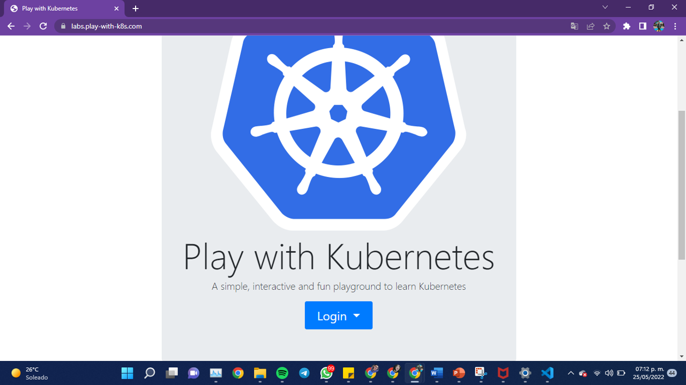

 - Agregar una instancia para configurar el primer clúster

 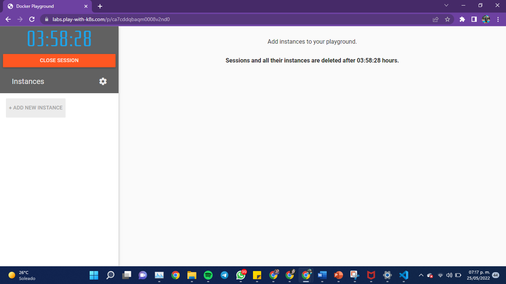


Paso 2. Ejecutar los siguientes comandos en la primera instancia, el cual sera en nodo Master.

- Nos permite inicializar el nodo del plano de control de Kubernetes. 
- Debemos correr los comandos que se nos indican para copiar las configuraciones al directorio correcto.
- Finalmente instalamos el sistema de Networking de Kubernetes en este caso weave.
```
kubeadm init --apiserver-advertise-address $(hostname -i)
mkdir -p $HOME/.kube
chown $(id -u):$(id -g) $HOME/.kube/config
kubectl apply -n kube-system -f \
    https://cloud.weave.works/k8s/net?k8s-version=$(kubectl version | base64 |tr -d '\n')
```
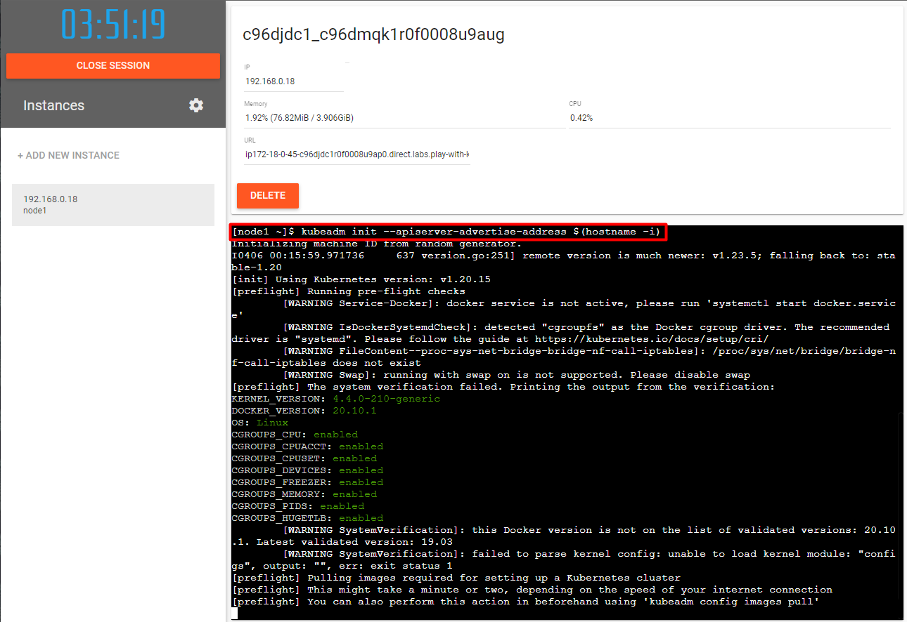
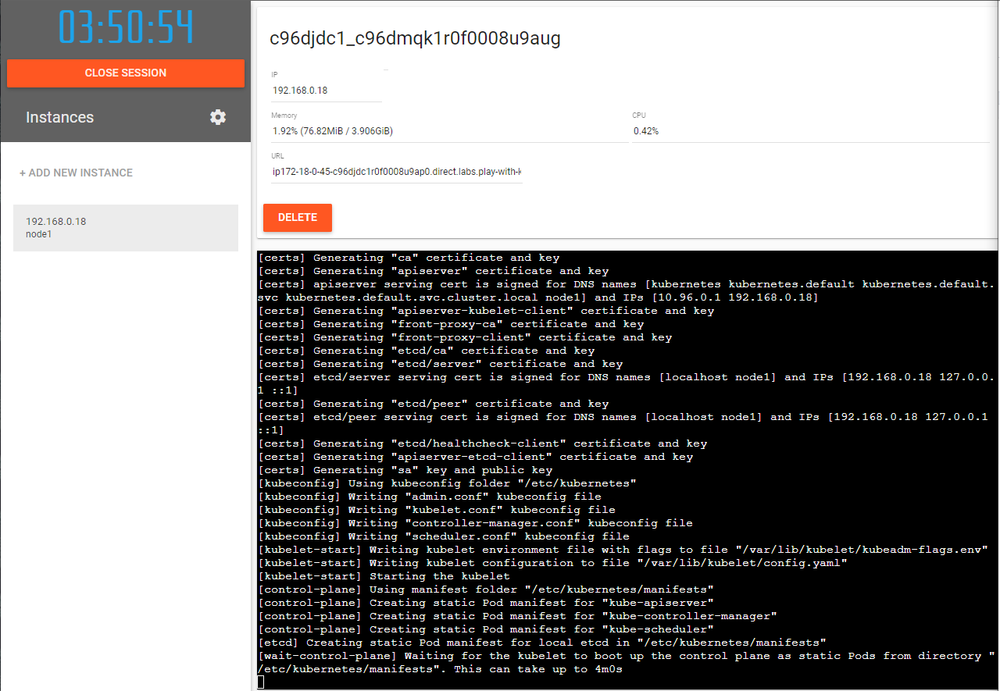
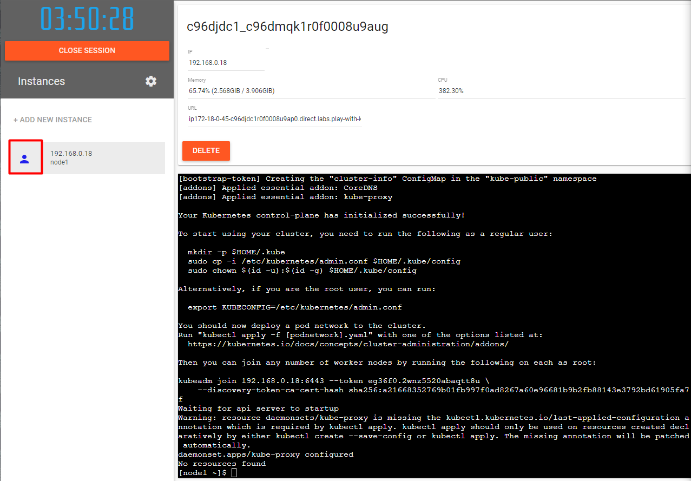


## Agregación de 4 nodos trabajadores

### Node 1
- Clic en ```Add instance``` y esperar unos minutos para que se complete la ejecución.
- Del nodo Master copie el token que se muestra a continuación para que se convierta en un nodo trabajador: 
```
kubeadm join 192.168.0.18:6443 --token eg36f0.2wnz5520abaqtt8u --discovery-token-ca-cert-hash sha256:a21668352769b01fb997f0ad8267a60e96681b9b2fb88143e3792bd61905fa7f
```


- Asi se muestra el nodo trabajador: 

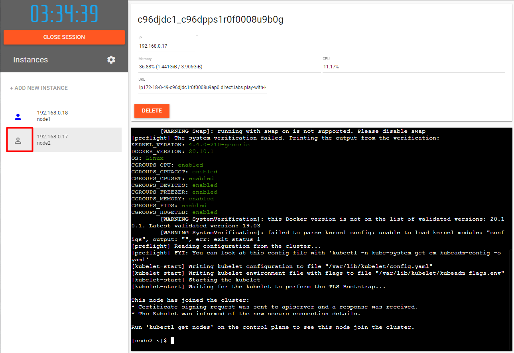

### Node 2 

- Clic en ```Add instance``` y esperar unos minutos para que se complete la ejecución.
- Del nodo Master copie el token que se muestra a continuación para que se convierta en un nodo trabajador: 
```
kubeadm join 192.168.0.18:6443 --token eg36f0.2wnz5520abaqtt8u --discovery-token-ca-cert-hash sha256:a21668352769b01fb997f0ad8267a60e96681b9b2fb88143e3792bd61905fa7f
```

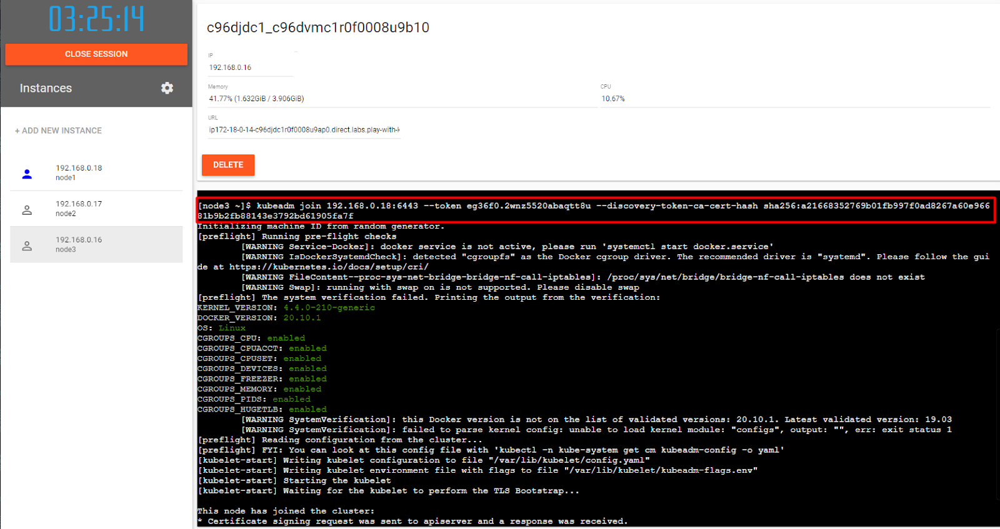


- Asi se muestra el segundo nodo trabajador

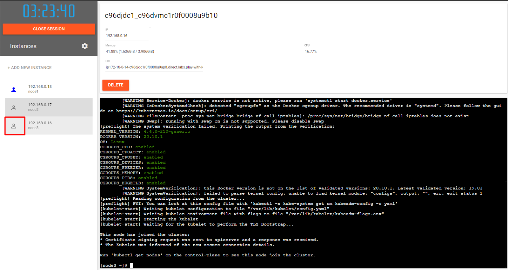

### Node 3

- Clic en ```Add instance``` y esperar unos minutos para que se complete la ejecución.
- Del nodo Master copie el token que se muestra a continuación para que se convierta en un nodo trabajador: 
```
kubeadm join 192.168.0.18:6443 --token eg36f0.2wnz5520abaqtt8u --discovery-token-ca-cert-hash sha256:a21668352769b01fb997f0ad8267a60e96681b9b2fb88143e3792bd61905fa7f
```


- Asi se muestra el segundo nodo trabajador

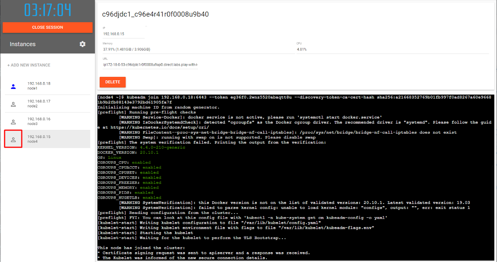

### Node 4

- Clic en ```Add instance``` y esperar unos minutos para que se complete la ejecución.
- Del nodo Master copie el token que se muestra a continuación para que se convierta en un nodo trabajador: 
```
kubeadm join 192.168.0.18:6443 --token eg36f0.2wnz5520abaqtt8u --discovery-token-ca-cert-hash sha256:a21668352769b01fb997f0ad8267a60e96681b9b2fb88143e3792bd61905fa7f
```

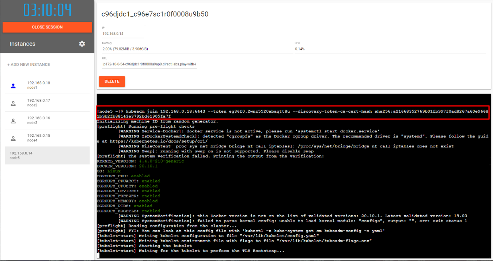

- Asi se muestra el segundo nodo trabajador

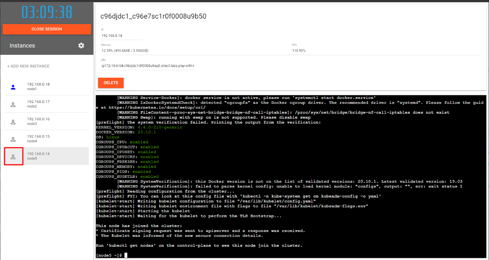

## Verificación de los nodos en el nodo Master

- Ejecutar el siguiente comando para visualizar los nodos y que su estado se encuentre en **Ready**:
```
kubectl get nodes
```


## Muestra los detalles de los recursos 
- Con el siguiente comando, en esta ocasión no se encuentran recursos debido a que no se ha especificado.
```
kubectl get po
```
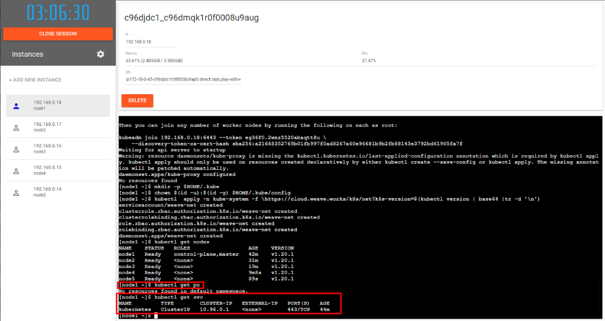

## Visualizar el servicio que se ha creado
- Ejecutando el siguiente comando:
```
kubectl get svc
```


## Mostrar la capacidad de todos nuestros nodos como un flujo de objetos JSON
- Ejecutando el siguiente comando:

```
kubectl get nodes -o json |
      jq ".items[] | {name:.metadata.name} + .status.capacity"
```
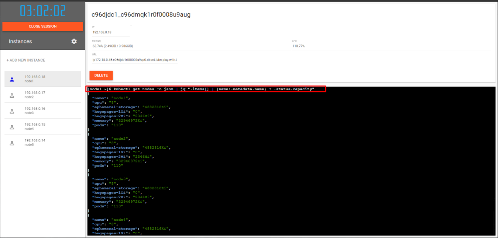
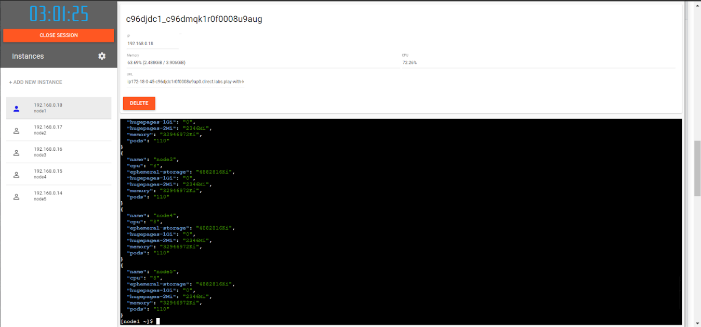


## Enumere los pods en el espacio de nombres del sistema kube:
- Acceso a espacios de nombres.

De forma predeterminada donde kubectl utiliza el espacio de nombres predeterminado. Podemos cambiar a un espacio de nombres diferente con la opción -n.

Hay dos formas de consultarlo:
```
1. kubectl -n kube-system get pods
```

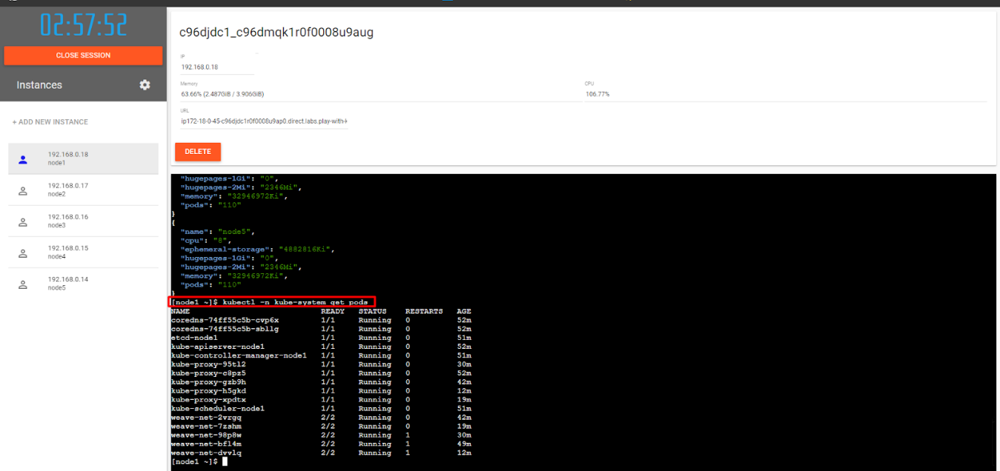


```
2. kubectl get pods -n kube-system
```


### Donde:
- **etcd** es nuestro servidor etcd
- **kube-apiserver** es el servidor API
- **kube-controller-manager** y **kube-scheduler** son otros componentes maestros
- **kube-dns** es un componente adicional (no obligatorio pero muy útil, así que está ahí)
- **kube-proxy** es el componente (por nodo) que administra las asignaciones de puertos y demás
- **weave** es el componente (por nodo) que administra la superposición de red
- **READY** columna que indica el número de contenedores en cada cápsula. Los pods con un nombre que termina en -node1son los componentes maestros (se han "fijado" específicamente al nodo maestro).


# Ejecutar el Portainer en el clúster de Kubernetes (nodo Master)

## Requisito previo
- Tener configurado el clúster de Kubernetes.

## Ejecute el siguiente comando

```
kubectl apply -f https://raw.githubusercontent.com/portainer/portainer-k8s/master/portainer-nodeport.yaml
```
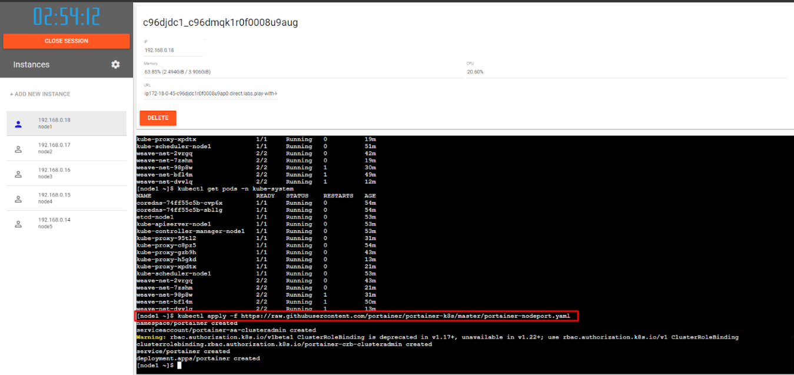

## Verificación de los portainer
```
kubectl get po,svc,deploy -n portainer
```
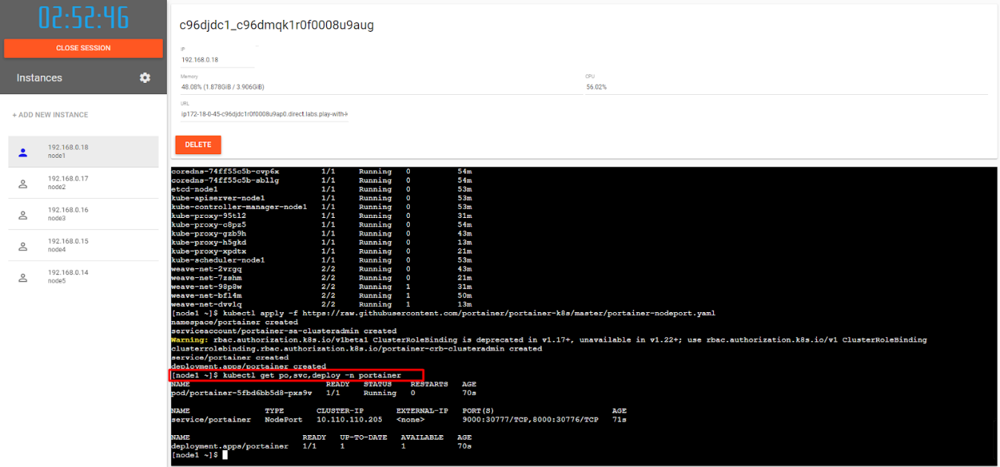

# Resultado
## Apertura en el navegador
- No se logro obtener la conexión al navegador debido al puerto, sin embargo la creación y verificación del Master y los nodos trabajadores se logro concluir con éxito, así como los resto de los objetivos.

*NOTA:* Es importante verificar que el token sea correcto al momento de ingresarlo a los nodos trabajadores para que no tengan ningún conflicto.

```
https://ip172-18-0-7-bs6kb2bmjflg00fa5g4g-<ADD 30777 HERE>.direct.labs.play-with-k8s.com/
```
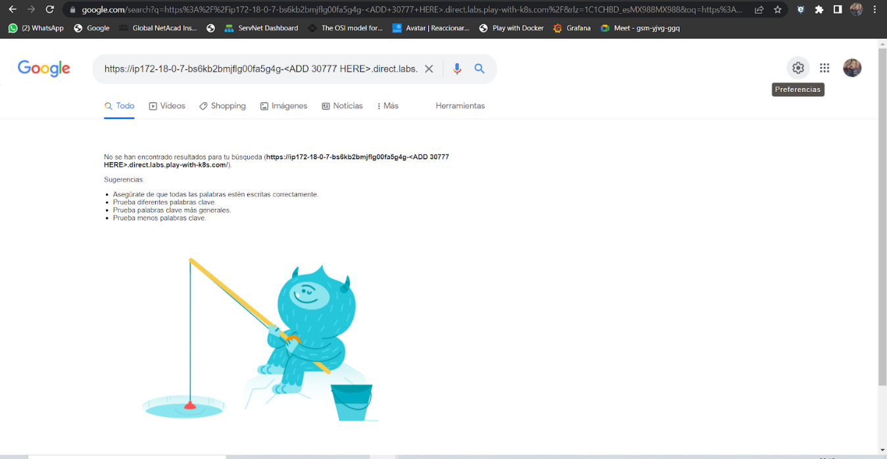

## Conclusiones

### Jessica
Finalmente puedo concluir que la virtualización junto con la tecnología de Kubernetes es de gran importancia hoy en día debido a que nos permiten la creación de múltiples entornos simulados o recursos dedicados desde un solo sistema de hardware físico, ofreciendo muchas ventajas como la gestión y optimización de los recursos TI. Así mismo esta tecnología ha dado un giro muy importante en mundo en el sentido del desarrollo y despliegue de aplicaciones, sin embargo esto no sería posible sin Kubernetes.
### Daniela Leonila 
Puedo concluir que el tema de implementación de herramientas de virtualización IaaS nos ayudo a poder identificar cada unas de las partes que lo componen y las diferencias que tiene en base a contenedores o maquinas virtuales. En base a esto, esta práctica fue indispensable para poder visualizar como se crean los nodos, ademas de visualizar su estado, la capacidad que contiene cada uno, y por ultimo la verificación de cada uno de los portainer integrados mediante la herramienta de Kubernetes.
### Abdaeel
Puedo concluir que que la virtualización apoyada de la herramienta de Kubernetes ha sido de gran ayuda para tener conocimiento de la misma, además de aprender a usarlo. Tiene una importancia relevante, ya que nos permite crear varios entornos en forma de simulación. En el área de las Tecnologías de la Información nos ayuda a poder gestionar de forma correcta los recursos que se utilizarán dentro de la misma plataforma.
Aprendí a crear nodos y explorar sus características y estado en el que se encuentren al momento de estar ejecutando código.

## Importancia de Kubernetes para la aplicación de soluciones IaaS
Kubernetes mantiene en funcionamiento las aplicaciones que se  encuentran dentro de los contenedores, además la forma de programar e implementar dichos contenedores y lograr escalarlo hacia el estado que se desea y administrar cada uno de sus ciclos de vida, es importante mencionar que Kubernetes es un motor de orquestación de contenedores de código abierto por el cual se pueden configurar Plataforma como servicio, algunos logran ofrecer versiones de IaaS (Infraestructura como servicio) agregando solo una capa de IaaS debajo de K8. Cuando se utiliza en la nube este implementa la flexibilidad de infraestructura como servicio (Iaas) y permite la portabilidad y el escalado simplificado.

## Fuentes de información
[1] 	RedHat, «¿Qué es un clúster de Kubernetes?,» 15 Enero 2020. [En línea]. Available: https://www.redhat.com/es/topics/containers/what-is-a-kubernetes-cluster. [Último acceso: 25 Mayo 2022].

[2] 	S. I. S. Ortiz, «Computo_Nube,» 30 March 2022. [En línea]. Available: https://github.com/ssoto123/Computo_Nube/commits?author=ssoto123. [Último acceso: 25 Mayo 2022].

[3] 	Oneclick, «Kubernetes – everything you need to know,» 05 February 2021. [En línea]. Available: https://oneclick-cloud.com/en/blog/trends-en/kubernetes/. [Último acceso: 25 Mayo 2022].

[4] 	Google Cloud, «Google Kubernetes Engine,» [En línea]. Available: https://cloud.google.com/kubernetes-engine/docs/deploy-app-cluster?hl=es-419. [Último acceso: 25 Mayo 2022].

[5] 	Sabrina, «Tutorial de Kubernetes – Parte 2: Configuración,» 16 Agosto 2018. [En línea]. Available: https://guiadev.com/tutorial-de-kubernetes-parte-2-configuracion/. [Último acceso: 25 Mayo 2022].

## Aprendizaje
 Algunos de los aprendizajes que obtuvimos al realizar esta práctica y reporte técnico es la implementación de un número específico de nodos y su ejecución en un estado deseado, asi mismo el lanzamiento que es un cambio en la implementación, Kubernetes permite iniciar, poner en pausa y reanudar los lanzamientos. Además el descubrimiento de servicios donde esta herramienta expone automáticamente los contenedores o nodos, utilizando nombres o direcciones IP, finalmente el suministro de almacenamiento donde se puede montar localmente o en la nube según sea necesario. Así mismo la integración de pod los cuales son grupo de contenedores con almacenamiento y especificaciones de cómo ejecutar dichos contenedores. 
